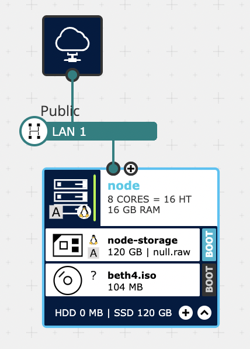

# single node install on IONOS cloud



## Pre-requisites

* [terraform](https://www.terraform.io/) to provision resources via the [ionoscloud terraform provider](https://registry.terraform.io/providers/ionos-cloud/ionoscloud/latest/docs)
* [aicli](https://github.com/karmab/aicli) to interact with the assisted installer at the [Red Hat Hybrid Cloud Console](https://console.redhat.com/openshift)
* One public IP address with [3 DNS entries](https://docs.openshift.com/container-platform/4.11/installing/installing_sno/install-sno-preparing-to-install-sno.html)
* 1 node with [minimum requirements](https://docs.openshift.com/container-platform/4.11/installing/installing_sno/install-sno-preparing-to-install-sno.html#install-sno-requirements-for-installing-on-a-single-node_install-sno-preparing)

## prepare the cluster

* Download your [OpenShift pull secret](https://console.redhat.com/openshift/install/pull-secret)
into `openshift_pull.json` in this directory.
* Edit [aicli-params.yaml](aicli-params.yaml)

Now create the cluster and download the ISO boot image

```
CLUSTER_NAME=beth
aicli create cluster --paramfile aicli-params.yaml $CLUSTER_NAME
aicli download iso $CLUSTER_NAME
```

Upload the iso image to [ftps://ftp-txl.ionos.com/iso-images](ftps://ftp-txl.ionos.com/iso-images)

Visit the [Red Hat Hybrid Cloud Console](https://console.redhat.com/openshift) and you should see your cluster in "draft" state.


## IONOS infrastructure

See [variables.tf](variables.tf) for available variables - you can override them from the command line with `-var`.


```
export TF_VAR_ionos_username=yourusername
export TF_VAR_ionos_password=yourpassword
terraform init
terraform apply
```

*NOTE* After creating the infrastructure, visit [dcd](https://dcd.ionos.com/) and set every
server to boot from the storage instead from the boot CDROM

## install the cluster

Wait until all hosts show up at [Red Hat Hybrid Cloud Console](https://console.redhat.com/openshift) or at
* `aicli list host`

Now start the installation
* `aicli start cluster $CLUSTER_NAME`
* `watch aicli get events $CLUSTER_NAME`
